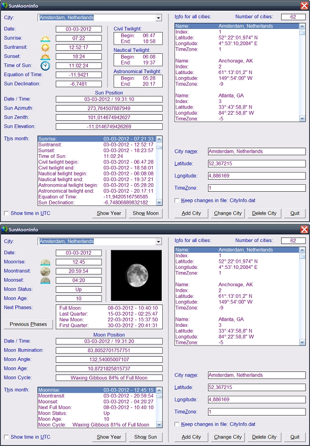



## SunMoonInfo

### Description

Add system date format detection.

SunMoonInfo v3.0 Add MoonInfo and name changed in SunMoonInfo.

The routines for MoonPhase and MoonPosition are adopted from

Thomas A. Swift, Lunar Calculator 2.1 and can be found at:

http://www.planet-source-code.com/vb/scripts/ShowCode.asp?txtCodeId=66957&lngWId=1

Some little corrections are make.

Second Version: Fixed some bugs, add Twilight times (Atronomical, Nautical end Civil)

Add sub: SunPosition(Byval IsDate As Date), returns in Event ResultSunPostion the values: IsDate, SunAzimuth, SunZenith and SunElevation. You can also show the times by UTC.

Decimal sign bug fixed.

SunInfo returns the Sunrise, Suntransit, Sunset, Equation Of Time and Sun Declination of the selected city and date. You can add, change or delete cities. They can be saved in the file CityInfo.dat
 
### More Info
 

             |
---                |---
**Submitted On**   |2012-03-03 03:00:00
**By**             |[Ben Vonk](https://github.com/Planet-Source-Code/PSCIndex/blob/master/ByAuthor/ben-vonk.md)
**Level**          |Intermediate
**User Rating**    |4.9 (34 globes from 7 users)
**Compatibility**  |VB 6\.0
**Category**       |[Custom Controls/ Forms/  Menus](https://github.com/Planet-Source-Code/PSCIndex/blob/master/ByCategory/custom-controls-forms-menus__1-4.md)
**World**          |[Visual Basic](https://github.com/Planet-Source-Code/PSCIndex/blob/master/ByWorld/visual-basic.md)
**Archive File**   |[SunMoonInf2221723162012\.zip](https://github.com/Planet-Source-Code/ben-vonk-sunmooninfo__1-74241/archive/master.zip)

